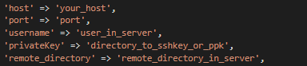
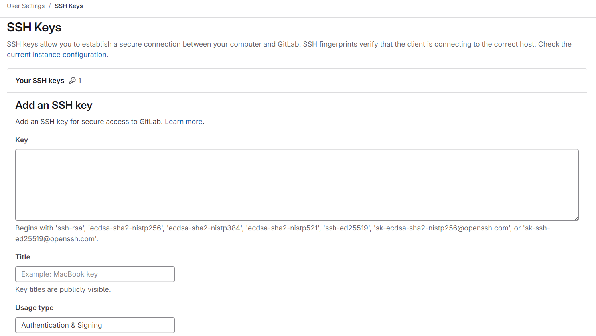
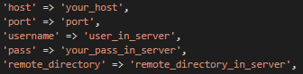
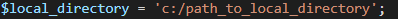

# ⚡CI/CD with PHP⚡

🎆 CI/CD with PHP (Continuous Integration and Continuous Delivery) is a tool that will help you quickly deploy your projects to the server based on PHP 🚀.

# ¿How to configure it?⚙️
You go to the Server.php file.
There you can find 2 ways to connect, by ssh key or the other by normal password.
In case of ssh key, just follow the instructions.



**_Keep this in mind if you are going to work with ssh key:_**

If you are using GitLab or GitHub, you should look for the ssh key section, it will ask you to paste your ssh key and then give it a title.



And click on "Add key".

If you are using Windows you must change the permissions of the ssh key, to avoid permission errors.

**_Reset the file to remove explicit permissions._**

``` 
icacls C:/path_to_ssh_key /reset
```

**_Give explicit permission to the current user._**

```
icacls C:/path_to_ssh_key /grant:r "$($env:username):(R)"
```

**_Give explicit read permission to the current user._**

```
icacls C:/path_to_ssh_key /inheritancer:r
```

In case of normal password, just follow the instructions.



If you want both configurations you can use it following the previous configurations.

**Finally we configure the path to the local repository.**



# ¿How to deploy?🚀
To start the deployment just run the following command:
```
php deploy.php
```

## ❤️ Support the proyect  
If you find this project useful, consider supporting me with a coffee! 😊☕ 

[](https://paypal.me/danielDev007)